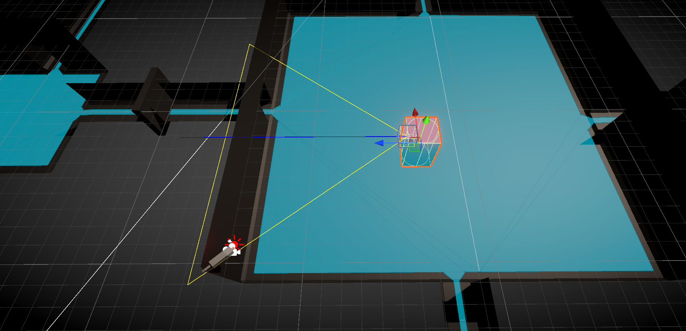
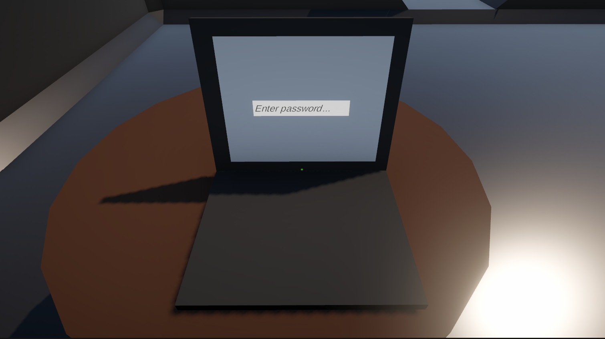
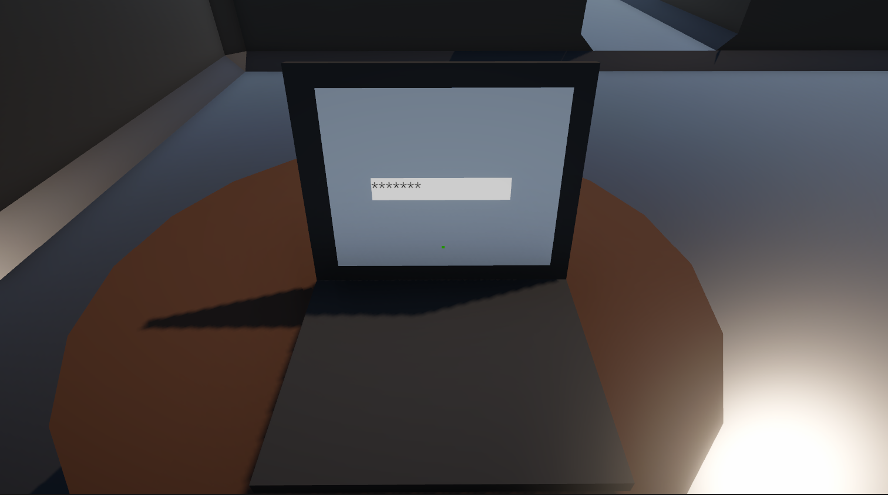
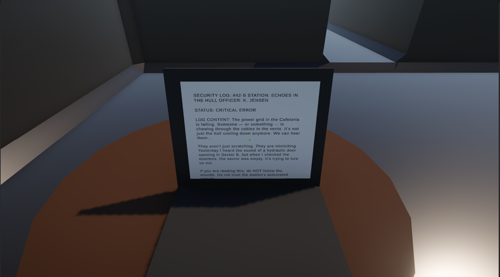
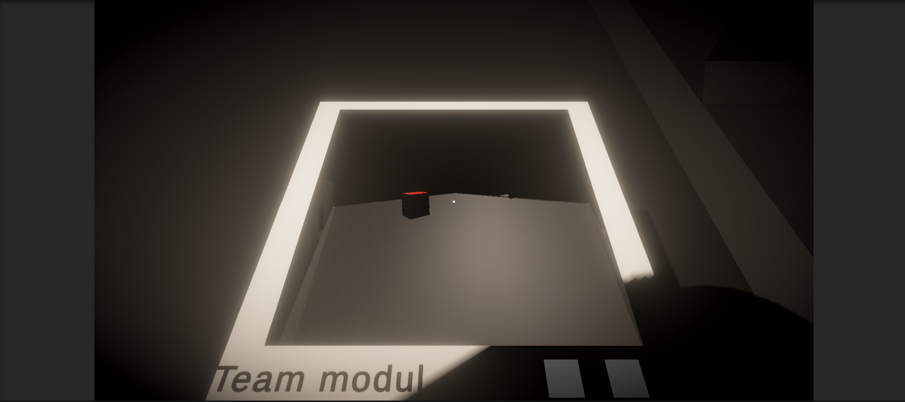
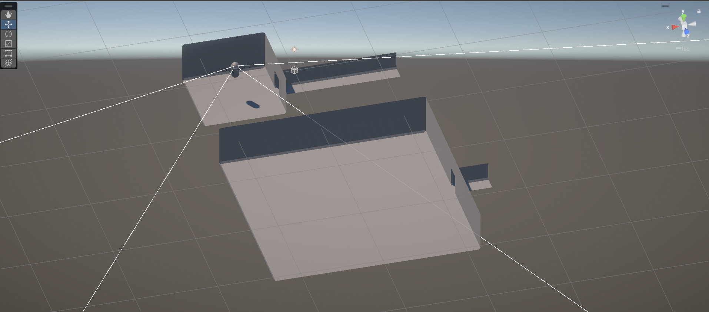
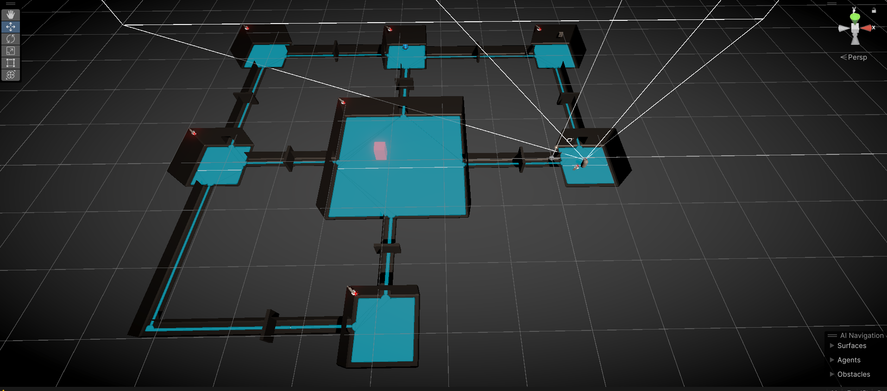

# ECHOES IN THE HULL 

**Echoes in the Hull** is a technical atmospheric horror demo set aboard a derelict space station. The project focuses on deep environment interaction, power grid management, and a predatory AI system that hunts the player through the ship's claustrophobic corridors.

---

## 👾 Advanced AI System: "The Beast"

The core antagonist features a custom-built, multi-modal detection system designed for stealth gameplay.

### 1. Field of View (FOV) & Vision
* **Conic Vision**: Uses trigonometric angle calculations combined with physics-based Raycasts to simulate realistic eyesight.
* **Gizmos Debugging**: Integrated visual tools to calibrate detection angles ($0^\circ$ to $180^\circ$) and distance in real-time.

*Visualizing the predator's detection cone and line-of-sight.*

### 2. Auditory Perception & Memory
* **Hearing**: Reacts to sound events within the environment, shifting states to investigate noise sources.
* **Last Known Position (LKP)**: If the player breaks line-of-sight, the AI navigates to the last seen coordinate to perform a localized search.

---

## 🎒 Equipment & Gear

### 1. Terminal Systems (Laptop)
Static terminals found throughout the station are used for narrative delivery and security overrides.
* **Authentication**: Functional password entry system.
* **Data Retrieval**: Access to security logs and critical station status reports.

*Terminal interaction sequence: Authentication, Password Entry, and Security Log access.*

### 2. Mobile Terminal (Tablet)
The player's primary mobile interface for diagnostics and real-time ship logs.

*Updated mobile terminal with high-resolution labels and hand-held model.*

### 3. Flashlight & Combined Gear
A dynamic light source with high-fidelity shadows designed to build tension.

*Demonstration of spot-light logic and simultaneous equipment usage.*

---

## 🗺 Map Layout & Navigation

The station architecture is built on a modular grid optimized for AI pathfinding and power-zone management.

### Deck Schematics & NavMesh
A fully baked NavMesh covers the entire deck, allowing the Beast to navigate complex rooms and technical crawlspaces seamlessly.

*Station architecture nodes, visual volume calibration, and baked NavMesh data.*

---

## 🛠 Technical Systems

### 1. Power Management Grid
A centralized logic hub (`PowerManager.cs`) governing station functionality:
* **Grid States**: Monitoring of global `_isPowerWorking` status.
* **Overrides**: Emergency reboot sequences and blast door lockdowns.

### 2. Interactive Door Systems
Modular sliding doors with trigger protection and power-grid dependency.

*Trigger zones and interaction points for automated door systems.*

---

## 🚀 Tech Stack
* **Engine**: Unity 2022.3 LTS
* **Animation**: DOTween (Digital Ruby)
* **AI Architecture**: Custom Finite State Machine (FSM) + NavMesh
* **Architecture**: Namespace-based, Event-driven (C#)

---

## ⚖️ Legal Notice

**Copyright (c) 2026 [Zakhar/xvostik201]**

This project is a **work in progress** and is the sole property of the developer. 

* **Purpose:** This repository is intended for portfolio demonstration and educational review.
* **Permissions:** No part of this project (code, assets, or design) may be reproduced, redistributed, or used in other projects without prior written consent from the author.
* **Current Status:** Closed Source / All Rights Reserved.

---

**ECHOES IN THE HULL** — *Something is breathing in the vents. Don't let the power go out.*
