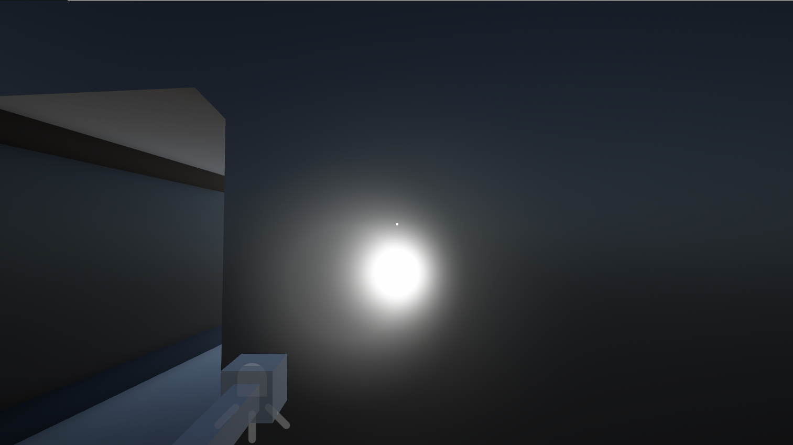
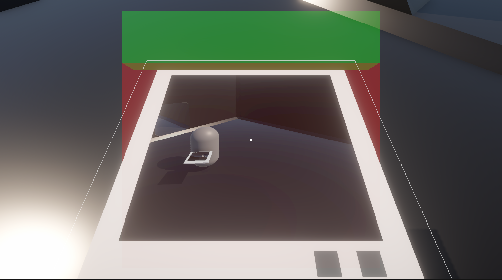
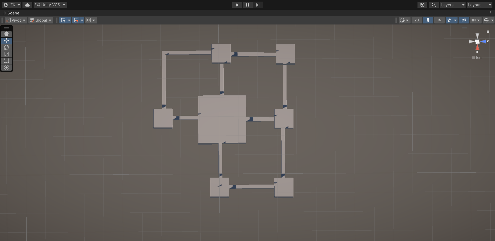
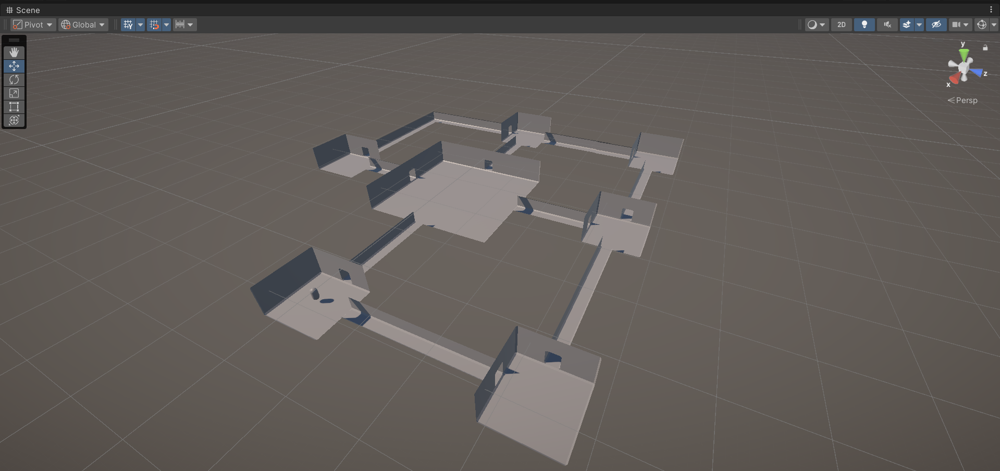
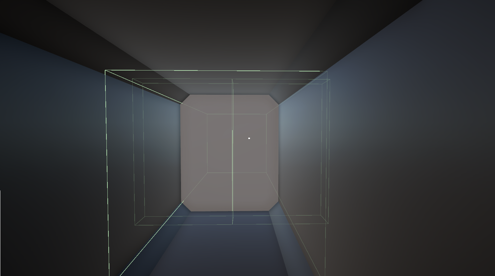
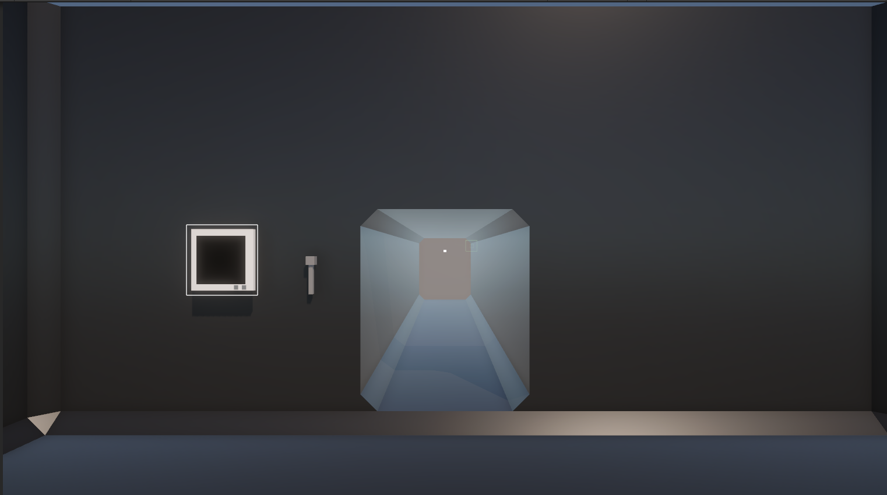

# Project: Echoes of the Void

Техническая демо-версия систем взаимодействия и архитектуры уровня. Проект сфокусирован на создании атмосферного окружения с глубокой интеграцией систем жизнеобеспечения.

---

## 🛠 Технические Системы (Systems)

### 1. Система Питания и Управления (Power Management)
Централизованная система контроля электросетей. Позволяет управлять состоянием всех активных объектов на уровне.
* **Скрипт:** `PowerManager.cs`
* **Функционал:** Перезагрузка систем, принудительное закрытие гермозатворов, контроль `_isPowerWorking` стейта.

### 2. Система Интерактивных Дверей (Door System)
Автоматические раздвижные двери с поддержкой локальных координат.
* **Особенности:** Использование `DOTween` для плавных анимаций, оптимизация через `TryGetComponent`, защита от спама триггеров через `DOKill`.
* **Логика:** Зависимость от питания. При отключении энергии двери блокируются в безопасном (закрытом) состоянии.

---

## 🎒 Оснащение (Equipment)

### Снаряжение Игрока
* **Фонарик (Flashlight):** Динамический источник света с проработанными тенями для создания атмосферы.
* **Планшет (Tablet):** Мобильный терминал игрока. В текущей итерации служит базой для вывода системных логов и карты.

*Демонстрация работы освещения и модели планшета в руках.*

---

## 🗺 Планировка и Карта (Map Layout)

Уровень спроектирован по модульному принципу, что позволяет гибко настраивать логистику игрока и зоны ответственности систем питания.

### Глобальный вид (Top-Down View)

*Архитектура станции: видны основные узлы, переходы и зоны размещения дверей.*

### Пространственная перспектива

*Тестирование масштабов и визуального объема помещений.*

---

## 📸 Скриншоты Разработки

### Взаимодействие и триггеры

*Визуализация зон триггеров для автоматических систем.*

### Рабочее окружение

*Проверка систем взаимодействия в редакторе Unity.*

---

## 🚀 Технологический стек
* **Engine:** Unity 2022.3 LTS
* **Animation:** DOTween (Digital Ruby)
* **Architecture:** Namespace-based, Event-driven (C#)
